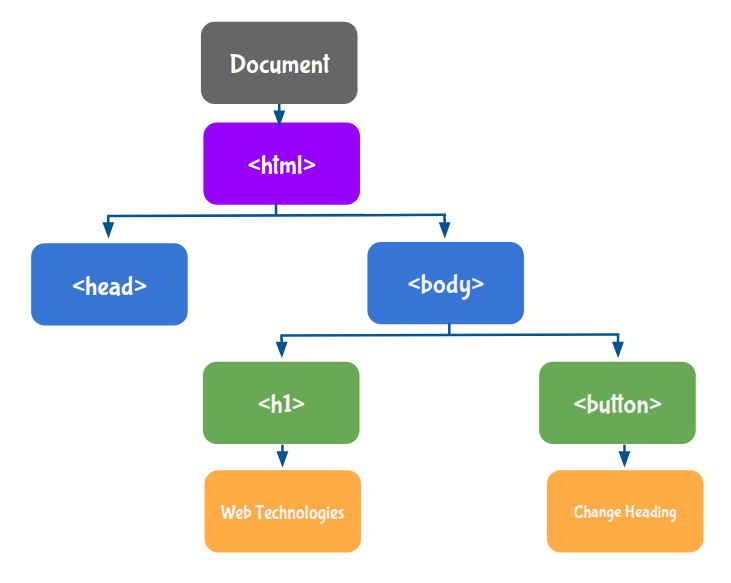

# DOM and Event Fundamentals

## JavaScript Variables

### Variable Declaration

Variables are like containers for storing values. We can create a variable using the `let` keyword.

```Javascript
let message;
```

### Assigning a Value to the Variable

We can put data into a variable using an assignment operator `(=)`.

```Javascript
let message = 'Hello Rahul';
```

```Javascript
let message;
message = 'Hello Rahul';
```

<b>Note</b>

Printing a variable without assigning a value will give the output undefined.

## Document Object Model (DOM)

The DOM is the structured representation of the HTML document created by the browser. It allows JavaScript to manipulate, structure, and style your website.

```HTML
<!DOCTYPE html>
<html>
  <head></head>
  <body>
    <h1>Web Technologies</h1>
    <button>Change Heading</button>
  </body>
</html>
```

### Document Object

It is the entry point of the DOM. For accessing any HTML Element, you should always start with accessing the document object first.

### HTML DOM Tree

The DOM tree represents an HTML document as nodes. Each node is referred to as an Object.



### Methods

#### getElementById

The `getElementById()` method helps to select the HTML Element with a specific ID.

```Javascript
console.log(document.getElementById("headingElement"))
```

### Properties

#### textContent

To manipulate the text within the HTML Element, we use `textContent` Property.

#### style

The `style` property is used to get or set a specific style of an HTML Element using different CSS properties.

Use Camel Case naming convention `(starting letter of each word should be in the upper case except for the first word) for naming the Style Object Properties.

For example, `color`, `fontFamily`, `backgroundColor`, etc.

### Events

Events are the actions by which the user or browser interacts with the HTML Elements. Actions can be anything like clicking a button, pressing keyboard keys, scrolling the page, etc.

#### onclick Event

The `onclick` event occurs when the user clicks on an HTML Element. We will give the name of the function as a value for the HTML `onclick` attribute.

```HTML
<body>
  <h1 id="headingElement">Web Technologies</h1>
  <button onclick="manipulateStyles()">Change Heading</button>
</body>
```

```Javascript
function manipulateStyles() {
  document.getElementById("headingElement").textContent = "4.O Technologies";
  document.getElementById("headingElement").style.color = "blue";
}
```

**DOM and Event Fundamentals**

# Primitive Types & Conditionals

## JavaScript Values

Basically In JavaScript values are of two categories.

- Primitive Types
- Reference Types

### Primitive Types

- Number
- Boolean
- String
- Undefined, etc.

| Primitive Type | Description                                                                                                                                            |
| -------------- | ------------------------------------------------------------------------------------------------------------------------------------------------------ |
| Number         | All the numbers are of Number type.                                                                                                                    |
| Boolean        | Boolean values are either true or false.                                                                                                               |
| String         | String is a stream of characters. The String should be enclosed with Single quotes, Double quotes, or Backticks.                                       |
| Undefined      | If a value is not assigned to the variable, then it takes `undefined` as its value. In JS, `undefined` refers to the value that is not being assigned. |

### Operators

#### typeof()

The `typeof()` operator is used to find the type of value.

```Javascript
let a = 900;
let b = 9.2;
console.log(typeof(a));  // number
console.log(typeof(b));  // number
```

```Javascript
let isApproved = false;
console.log(typeof(isApproved));
console.log(typeof(true));
```

## Converting String to a Number

In JavaScript, when we combine the number and string, it results in a string.

The `parseInt()` function accepts a string and converts it into an integer.

```Javascript
let a = '20';
console.log(typeof(a));  // string

let b = parseInt(a);
console.log(typeof(b));  // number
```

## Conditional Statements

The Conditional Statement allows you to execute a block of code only when a specific condition is true.

**If...Else Statement:**

<b>Syntax:</b>

```javascript
if (conditionA) {
  Block1;
} else if (conditionB) {
  Block2;
} else {
  Block3;
}
```

# Input Element and Math Functions

## Math Functions

### Math.random()

The `Math.random()` function returns a random number (float value) in range 0 to less than 1 (`0 <= randomNumber < 1`).

```Javascript
console.log(Math.random());
```

### Math.ceil()

The `Math.ceil()` function always rounds a number up to the next largest integer.

```Javascript
console.log(Math.ceil(95.906698007537561));  // 96
```

```JavaScript
let randomNumber = Math.random();
console.log(randomNumber);
console.log(randomNumber*1000);
console.log(Math.ceil(randomNumber*1000));
```

## HTML Elements

### HTML Input Element

The HTML input element creates interactive controls to accept the data from the user.

There are different types of inputs.

- Text
- Password
- Radio
- Date
- Checkbox

#### Text Input

```Javascript
<input type="text" />
```

**Note**

Default type for the HTML `input` element is `text`.

#### Password Input

It provides a way for the user to enter a password securely.

```Javascript
<input type="password" />
```

## DOM Properties

### Value

We can use the `value` property to get the value of the HTML `input` Element.

```Javascript
document.getElementById("inputElement").value;
```

```HTML
<!DOCTYPE html>
<html>
  <head></head>
  <body>
    <p>Enter your Name</p>
    <input type="text" id="inputElement" />
    <p>Enter your Password</p>
    <input type="password" />
    <div>
      <button onclick="signIn()">Sign In</button>
    </div>
    <p id="signInText"></p>
  </body>
</html>
```

```Javascript
let inputElement = document.getElementById("inputElement");
let signInTextElement = document.getElementById("signInText");
function signIn() {
  let inputValue = inputElement.value;
  let verifyText = "Hi " + inputValue + ", verifying your account...";
  signInTextElement.textContent = verifyText;
}
```

## Comparison Operator

### Loose equal to vs Strict equal to (`== vs ===`)

Loose equal to (`==`): Loose equality compares two values for equality but doesn’t compare types of values.

Strict equal to (`===`): Strict equality compares two values for equality including types of values.

```Javascript
console.log(2 == '2');  // true
console.log(2 === '2');  // false
```

# Arrays & More DOM Manipulations

## Data Structures

Data Structures allow us to store and organize data efficiently. This makes us access and performs operations on the data smoothly.

In JavaScript, we have built-in Data Structures like,

- Arrays
- Objects
- Sets
- Maps

## Arrays

An Array holds an ordered sequence of items

### Creating an Array

```Javascript
let myArray = [5, "six", 2, 8.2]
console.log(myArray) // [5, "six", 2, 8.2]
```

### Accessing an Array items

```JavaScript
let myArray = [5, "Six", 2, 8.2];

console.log(myArray[0]); // 5

console.log(myArray[1]); // six
```

### Modifying an Array items

```JavaScript
let myArray = [5, "Six", 2, 8.2];
myArray[1] = 6;

console.log(myArray) // [5, 6, 2, 8.2]
```

### Finding Array Length

The `array.length` is used to find the number of items in the array.

```Javascript
let myArray = [5, "Six", 2, 8.2];
let lengthOfArray = myArray.length;

console.log(lengthOfArray) // 4
```

### Array Methods

#### push()

The `push()` method adds new items to the end of the array.

```Javascript
let myArray = [5, "six", 2, 8.2];
myArray.push(true);

console.log(myArray);  // [5, "six", 2, 8.2, true]
```

#### pop()

The `pop()` method removes the last item of an array and returns that item.

```Javascript
let myArray = [5, "six", 2, 8.2];
let lastItem = myArray.pop();

console.log(myArray);  // [5, "six", 2]

console.log(lastItem);  // 8.2
```

```Javascript
let myArray = [5, "six", 2, 8.2];
myArray[1] = 7;
myArray.pop();
myArray.push("seven");

console.log(myArray);
```

## Functions

### Function Declaration

```Javascript
function showMessage() {
  console.log("Hello");
}

showMessage();
```

### Function Expression

There is another syntax for creating a function which is called Function Expression.

```Javascript
let showMessage = function() {
  console.log("Hello");
};

showMessage();
```

## More DOM Manipulations

### Creating an HTML Element - `createElement()`

```Javascript
let h1Element = document.createElement("h1");
h1Element.textContent = "Web Technologies";

console.log(h1Element);  // <h1>Web Technologies</h1>
```

### Appending to an HTML Element - `appendChild()`

**Appending to Document Body Object:**

```Javascript
document.body.appendChild(h1Element);
```

**Appending to Existing Container Element:**

```Javascript
let containerElement = document.getElementById("myContainer");
containerElement.appendChild(h1Element);
```

```HTML
<!DOCTYPE html>
<html>
  <head></head>
  <body>
    <div id="myContainer"></div>
  </body>
</html>
```

```Javascript
let h1Element = document.createElement("h1");
h1Element.textContent = "Web Technologies";

let containerElement = document.getElementById("myContainer");
containerElement.appendChild(h1Element);

let btnElement = document.createElement("button");
btnElement.textContent = "Change Heading";
containerElement.appendChild(btnElement);
```

### Adding Event Listeners Dynamically

```Javascript
let btnElement = document.createElement("button");
btnElement.textContent = "Change Heading";
document.getElementById("myContainer").appendChild(btnElement);

btnElement.onclick = function(){
  console.log("click event triggered");
};
```

### Providing Class Names Dynamically - `classList.add()`

```Javascript
btnElement.onclick = function(){
  h1Element.textContent = "4.0 Technologies";
  h1Element.classList.add("heading");

  console.log(h1Element);
};
```

```CSS
.heading {
  color: blue;
  font-family: "Caveat";
  font-size: 40px;
  text-decoration: underline;
}
```

### Removing Class Names Dynamically - `classList.remove()`

```Javascript
let removeStylesBtnElement = document.createElement("button");
removeStylesBtnElement.textContent = "Remove Styles";

document.getElementById("myContainer").appendChild(removeStylesBtnElement);

removeStylesBtnElement.onclick = function(){
  h1Element.classList.remove("heading");
};
```

```HTML
<!DOCTYPE html>
<html>
  <head></head>
  <body>
    <div id="myContainer"></div>
  </body>
</html>
```

```CSS
@import url("https://fonts.googleapis.com/css2?family=Bree+Serif&family=Caveat:wght@400;700&family=Lobster&family=Monoton&family=Open+Sans:ital,wght@0,400;0,700;1,400;1,700&family=Playfair+Display+SC:ital,wght@0,400;0,700;1,700&family=Playfair+Display:ital,wght@0,400;0,700;1,700&family=Roboto:ital,wght@0,400;0,700;1,400;1,700&family=Source+Sans+Pro:ital,wght@0,400;0,700;1,700&family=Work+Sans:ital,wght@0,400;0,700;1,700&display=swap");

.heading {
  color: blue;
  font-family: "Caveat";
  font-size: 40px;
  text-decoration: underline;
}
```

```Javascript
let h1Element = document.createElement("h1");
h1Element.textContent = "Web Technologies";

let containerElement = document.getElementById("myContainer");
containerElement.appendChild(h1Element);

let btnElement = document.createElement("button");
btnElement.textContent = "Change Heading and Add Styles";
containerElement.appendChild(btnElement);

btnElement.onclick = function(){
  h1Element.textContent = "4.0 Technologies";
  h1Element.classList.add("heading");
};

let removeStylesBtnElement = document.createElement("button");
removeStylesBtnElement.textContent = "Remove Styles";
containerElement.appendChild(removeStylesBtnElement);

removeStylesBtnElement.onclick = function(){
  h1Element.classList.remove("heading");
};
```

# Objects

## Object

An Object is a collection of properties.

A property is an association between a name (or key) and a value.

For example, a person has a name, age, city, etc. These are the properties of the person.

| Key       | Value    |
| --------- | -------- |
| firstName | Rahul    |
| lastName  | Attuluri |
| age       | 28       |
| city      | Delhi    |

### Creating an Object

We can add properties into `{}` as `key: value` pairs.

```Javascript
let person = {
  firstName: "Rahul",
  lastName: "Attuluri",
  age: 28,
};

console.log(person);  // Object {firstName: "Rahul", lastName: "Attuluri", age: 28}
```

#### Identifiers

A valid Identifier should follow the below rules:

- It can contain alphanumeric characters, \_ and $.
- It cannot start with a number.

**Valid Identifiers:**

```Javascript
firstName;
$firstName;
_firstName;
firstName12;
```

**Invalid Identifiers:**

```Javascript
12firstName;
firstName 12;
```

To use an Invalid identifier as a key, we have to specify it in quotes.

```javascript
let person = {
  firstName: "Rahul",
  lastName: "Attuluri",
  age: 28,
  1: "value1",
  "my choice": "value2",
};

console.log(person); // Object {1: "value1", firstName: "Rahul", lastName: "Attuluri", age: 28, my choice: "value2"}
```

## Accessing Object Properties

### Dot Notation

```javascript
let person = {
  firstName: "Rahul",
  lastName: "Attuluri",
  age: 28,
  1: "value1",
  "my choice": "value2",
};

console.log(person.firstName); // Rahul
```

Use Dot notation when the key is a valid Identifier.

### Bracket Notation

```Javascript
let person = {
  firstName: "Rahul",
  lastName: "Attuluri",
  age: 28,
  "1": "value1",
  "my choice": "value2",
};

console.log(person["firstName"]);  // Rahul
```

### Accessing Non-existent Properties

**Dot Notation:**

```javascript
let person = {
  firstName: "Rahul",
  lastName: "Attuluri",
  age: 28,
  1: "value1",
  "my choice": "value2",
};

console.log(person.gender); // undefined
```

**Bracket Notation:**

```javascript
let person = {
  firstName: "Rahul",
  lastName: "Attuluri",
  age: 28,
  1: "value1",
  "my choice": "value2",
};

console.log(person["gender"]); // undefined
```

### Variable as a Key

```Javascript
let person = {
  firstName: "Rahul",
  lastName: "Attuluri",
  age: 28,
};

let a = "firstName";

console.log(person[a]);  // Rahul

console.log(person.a);  // undefined
```

### Object Destructuring

To unpack properties from Objects, we use Object Destructuring. The variable name should match with the key of an object.

```javascript
let person = {
  firstName: "Rahul",
  lastName: "Attuluri",
  age: 28,
};

let { gender, age } = person;

console.log(gender); // undefined

console.log(age); // 28
```

```javascript
let person = {
  firstName: "Rahul",
  lastName: "Attuluri",
  age: 28,
  1: "value1",
  "my choice": "value2",
};

let a = "firstName";
let { gender, age } = person;

console.log(person.firstName);

console.log(person["gender"]);

console.log(person[a]);

console.log(person.a);

console.log(gender);

console.log(age);
```

## Modifying Objects

### Modifying Object Property

**Dot Notation:**

```javascript
let person = {
  firstName: "Rahul",
  lastName: "Attuluri",
  age: 28,
};

person.firstName = "Abhi";

console.log(person.firstName); // Abhi
```

**Bracket Notation:**

```Javascript
let person = {
  firstName: "Rahul",
  lastName: "Attuluri",
  age: 28,
};

person["firstName"] = "Abhi";

console.log(person["firstName"]);  // Abhi
```

### Adding Object Property

**Dot Notation:**

```Javascript
let person = {
  firstName: "Rahul",
  lastName: "Attuluri",
  age: 28,
};

person.gender = "Male";

console.log(person);  // Object {firstName: "Rahul", lastName: "Attuluri", age: 28, gender: "Male"}
```

**Bracket Notation:**

```javascript
let person = {
  firstName: "Rahul",
  lastName: "Attuluri",
  age: 28,
};

person["gender"] = "Male";

console.log(person); // Object {firstName: "Rahul", lastName: "Attuluri", age: 28, gender: "Male"}
```

## Property Value

The Value of Object Property can be

- Function
- Array
- Object

### Function as a Value

```javascript
let person = {
  firstName: "Rahul",
  lastName: "Attuluri",
  age: 28,
  run: function () {
    console.log("Start Running.");
  },
};

person.run(); // Start Running.
```

**Methods:**

A JavaScript method is a property containing a function definition.

For example, in `document.createElement();`, the document is an Object, `createElement` is a key and `createElement()` is a Method.

### Array as a Value

```Javascript
let person = {
  firstName: "Rahul",
  lastName: "Attuluri",
  age: 28,
  habits: ["Playing Chess", "Singing"],
};

console.log(person.habits);  // ["Playing Chess", "Singing"]

console.log(person.habits[0]);  // Playing Chess

console.log(person["habits"][1]);  // Singing
```

### Object as a Value

```javascript
let person = {
  firstName: "Rahul",
  lastName: "Attuluri",
  age: 28,
  habits: ["Playing Chess", "Singing", "Dancing"],
  car: {
    name: "Audi",
    model: "A6",
    color: "White",
  },
};

console.log(person.car.name); // Audi

console.log(person.car["model"]); // A6
```

### Object And Array

```Javascript
let person = {
  firstName: "Rahul",
  lastName: "Attuluri",
  age: 28,
  run: function () {
    console.log("Start Running.");
  },
  habits: ["Playing Chess", "Singing", "Dancing"],
  car: {
    name: "Audi",
    model: "A6",
    color: "White",
  },
};

person.run();

console.log(person.car.name);

console.log(person.car["model"]);
```

# Todos Application

## HTML Input Element

### Checkbox

The HTML `input` element can be used to create a Checkbox. To define a Checkbox, you need to specify the HTML type attribute with the value `checkbox` for an HTML `input` element.

```HTML
<input type="checkbox" />
```

### The HTML Label Element

The HTML `label` element defines a Label.

```HTML
<label for="myCheckbox">Graduated</label>
```

#### The HTML for Attribute

The HTML `for` attribute associates the HTML `label` element with an HTML `input` element.

```HTML
<input type="checkbox" id="myCheckbox" />
<label for="myCheckbox">Graduated</label>
```

## DOM Manipulations

### The htmlFor Property

We can use `htmlFor` property to add HTML `for` attribute to the HTML `label` element.

```Javascript
let labelElement = document.createElement("label");
labelElement.htmlFor = "myCheckbox";
```

### The setAttribute() Method

We can use `setAttribute()` method to set any HTML attribute name and its corresponding value. If the attribute already exists, the value is updated. Otherwise, a new attribute is added with the specified name and value.

**Syntax**: `Element.setAttribute(name, value);`

```Javascript
let labelElement = document.createElement("label");
labelElement.setAttribute("for", "myCheckbox");
```

```Javascript
let inputElement = document.createElement("input");

inputElement.type = "checkbox";
inputElement.id = "myCheckbox";
document.body.appendChild(inputElement);
```

## Loops

Loops allow us to execute a block of code several times.

- for...of Loop
- for...in Loop
- for Loop
- while Loop and many more.

### The for...of Loop

```Javascript
let myArray = [1, 2, 3, 4];

for (let eachItem of myArray) {
   console.log(eachItem);
}
```

```HTML
<li class="todo-item-container d-flex flex-row">
  <input type="checkbox" id="checkboxInput" class="checkbox-input" />
  <div class="d-flex flex-row label-container">
    <label for="checkboxInput" class="checkbox-label">
      Learn HTML
    </label>
    <div class="delete-icon-container">
      <i class="far fa-trash-alt delete-icon"></i>
    </div>
  </div>
</li>
```

### The HTML Code for creating a Todo Item:

```HTML
<li class="todo-item-container d-flex flex-row">
  <input type="checkbox" id="checkboxInput" class="checkbox-input" />
  <div class="d-flex flex-row label-container">
    <label for="checkboxInput" class="checkbox-label">
      Learn HTML
    </label>
    <div class="delete-icon-container">
      <i class="far fa-trash-alt delete-icon"></i>
    </div>
  </div>
</li>
```

## CSS Box Properties

### Border

The CSS border property is a shorthand property for:

- border-width
- border-style (required)
- border-color

For example,

```CSS
.button {
  border-style: dashed;
  border-width: 2px;
  border-color: #e4e7eb;
}
```

Instead of writing the CSS properties `border-style`, `border-width` and `border-color` individually, we can apply these properties at once with a single CSS property called `border`.

**Syntax**: `border: border-width border-style border-color`

```CSS
.button {
  border: 2px dashed #e4e7eb;
}
```

To specify the border on one of the four sides of an HTML element, you can use the below CSS properties.

- border-top
- border-bottom
- border-right
- border-left

```CSS
.button {
  border-top: 1px dotted #e4e7eb;
}
```

If the border is not required, we can apply the `none` as value to the CSS `border` property.

```CSS
.button {
  border: none;
}
```

For example, if the border property is not required on the top side of an HTML element. You can use,

```CSS
.button {
  border-top: none;
}
```

```HTML
    <div class="p-3">
      <button class="button-1">Learn more</button>
      <button class="button-2">Read more</button>
    </div>
```

```CSS
.button-1 {
  border-top: 2px dashed orange;
}

.button-2 {
  border-bottom: none;
}
```

## TodosList

# On-Demand Session

## Most Commonly Made Mistakes

### Most of the JS properties and methods should be in the Camel case.

Most of the JS properties and methods are in the Camel case (the starting letter of each word should be in uppercase except for the first word).

| Code                      | Mistake        | Correct Syntax            |
| ------------------------- | -------------- | ------------------------- |
| document.CreateElement()  | C in Uppercase | document.createElement()  |
| document.getElementbyId() | b in Lowercase | document.getElementById() |
| element.textcontent       | c in Lowercase | element.textContent       |
| element.classlist.add()   | l in Lowercase | element.classList.add()   |

## The ID should be the same in both the HTML and JS.

### Mistake

```HTML
<h1 id="heading">Shopping List</h1>
```

```JavaScript
let headingEl = document.getElementById("listHeading");
headingEl.textContent = "Items Needed";
```

In the above Code Snippets, the HTML element's text content doesn't change because the ID used in HTML and JS are different.

So, While accessing an HTML element with the ID using JS, the ID used in the HTML element and the document.getElementById method must be the same.

```HTML
<h1 id="heading">Shopping List</h1>
```

```JavaScript
let headingEl = document.getElementById("heading");
headingEl.textContent = "Items Needed";
```

### Mistake

```HTML
<h1 id="listHeading ">Shopping List</h1>
```

```JavaScript
let headingEl = document.getElementById("listHeading");
headingEl.textContent = "Items Needed";
```

The HTML element's text content doesn't change because there is an extra space at the end of the ID in the HTML code.

So, there shouldn't be any extra spaces in the IDs used in both the HTML and JS.

```HTML
<h1 id="listHeading">Shopping List</h1>
```

```JavaScript
let headingEl = document.getElementById("listHeading");
headingEl.textContent = "Items Needed";
```

## The Function name must be the same in both the Function declaration and the Function call.

### Mistake

```JavaScript
function greeting() {
  let message = "Hello Rahul";
  console.log(message);
}

greet();
```

As there is no function called `greet`, we will get an error in the above Code Snippet.

So, while calling a function, you must use the same function name used in the function declaration.

```JavaScript
function greeting() {
  let message = "Hello Rahul";
  console.log(message);
}

greeting();
```

# Todos Application Part - 2

## HTML Input Element

### Placeholder

Placeholder is the text that appears in the HTML input element when no value is set. We can specify it using the HTML attribute placeholder.

```HTML
<input type="text" placeholder="Enter your name" />
```

## JavaScript built-in Functions

### alert()

The `alert()` function displays an alert box with a specified message and an OK button.

```JavaScript
alert("Enter Valid Text");
```

## DOM Properties

### Checked

The `checked` property sets or returns the checked status of an HTML checkbox `input` element as a boolean value.

```JavaScript
let checkboxElement = document.getElementById(checkboxId);
checkboxElement.checked = true;
```

## DOM Manipulations

### The removeChild() Method

The `removeChild()` method removes an HTML child element of the specified HTML parent element from the DOM and returns the removed HTML child element.

```JavaScript
function onDeleteTodo(todoId) {
  let todoElement = document.getElementById(todoId);

  todoItemsContainer.removeChild(todoElement);
}
```

### The classList.toggle() Method

The `classList.toggle()` method is used to toggle between adding and removing a class name from an HTML element.

```JavaScript
function onTodoStatusChange(checkboxId, labelId) {
  let checkboxElement = document.getElementById(checkboxId);
  let labelElement = document.getElementById(labelId);

  labelElement.classList.toggle('checked');
}
```

We can replace classList.add() and classList.remove() methods with classList.toggle() method.

# Todos Application Part - 3

## Execution Context

The environment in which JavaScript Code runs is called Execution Context.

Execution context contains all the variables, objects, and functions.

Execution Context is destroyed and recreated whenever we reload an Application.

## Storage Mechanisms

### Client-Side Data Storage

Client-Side Data Storage is storing the data on the client (user's machine).

- Local Storage
- Session Storage
- Cookies
- IndexedDB and many more.

### Server-Side Data Storage

Server-Side Data Storage is storing the data on the server.

## Local Storage

It allows web applications to store data locally within the user's browser.

It is a Storage Object. Data can be stored in the form of key-value pairs.

Please note that both key and value must be strings. If their type is other than a string, they get converted to strings automatically.

| Key      | Value          |
| -------- | -------------- |
| fullName | Rahul Attuluri |
| gender   | Male           |
| city     | Delhi          |

To access and work with Local Storage we have below methods:

- setItem()
- getItem()
- clear()
- removeItem()

### The setItem() Method

The `setItem()` method can be used for storing data in the Local Storage.

**Syntax**: `localStorage.setItem("Key", "Value")`;

### The getItem() Method

The `getItem()` method can be used for getting data from the Local Storage.

**Syntax**: `localStorage.getItem("Key")`;

```Javascript
localStorage.setItem("fullName", "Rahul Attuluri");

localStorage.setItem("gender", "Male");

localStorage.setItem("city", "Delhi");

let fullName = localStorage.getItem("fullName");

let gender = localStorage.getItem("gender");

let city = localStorage.getItem("city");

console.log(fullName);
console.log(gender);
console.log(city);
```

## Values

### null

We use `null` in a situation where we intentionally want a variable but don't need a value to it.

```Javascript
let selectedColor = null;

console.log(selectedColor);  // null
console.log(typeof(selectedColor));  // object
```

## HTML Elements

### The textarea Element

The HTML `textarea` element can be used to write the multiline text as an input.

```HTML
<textarea rows="8" cols="55"></textarea>
```

- The HTML `rows` attribute specifies the number of lines.
- The HTML `cols` attribute specifies the number of characters per each line.

```HTML
<!DOCTYPE html>
<html>
  <head>
    <link rel="stylesheet" href="https://stackpath.bootstrapcdn.com/bootstrap/4.5.2/css/bootstrap.min.css" integrity="sha384-JcKb8q3iqJ61gNV9KGb8thSsNjpSL0n8PARn9HuZOnIxN0hoP+VmmDGMN5t9UJ0Z" crossorigin="anonymous" />
    <script src="https://code.jquery.com/jquery-3.5.1.slim.min.js" integrity="sha384-DfXdz2htPH0lsSSs5nCTpuj/zy4C+OGpamoFVy38MVBnE+IbbVYUew+OrCXaRkfj" crossorigin="anonymous"></script>
    <script src="https://cdn.jsdelivr.net/npm/popper.js@1.16.1/dist/umd/popper.min.js" integrity="sha384-9/reFTGAW83EW2RDu2S0VKaIzap3H66lZH81PoYlFhbGU+6BZp6G7niu735Sk7lN" crossorigin="anonymous"></script>
    <script src="https://stackpath.bootstrapcdn.com/bootstrap/4.5.2/js/bootstrap.min.js" integrity="sha384-B4gt1jrGC7Jh4AgTPSdUtOBvfO8shuf57BaghqFfPlYxofvL8/KUEfYiJOMMV+rV" crossorigin="anonymous"></script>
  </head>
  <body>
    <textarea rows="8" cols="55" id="message"></textarea>
    <br />
    <button class="btn btn-primary mt-1" id="saveButton">Save</button>
  </body>
</html>
```

```Javascript
let textAreaElement = document.getElementById("message");
let saveButton = document.getElementById("saveButton");

saveButton.onclick = function() {
  let userEnteredText = textAreaElement.value;
  localStorage.setItem("userEnteredText", userEnteredText);
};

let storedUserInputValue = localStorage.getItem("userEnteredText");

if (storedUserInputValue === null) {
  textAreaElement.value = "";
}
else {
  textAreaElement.value = storedUserInputValue;
}
```
